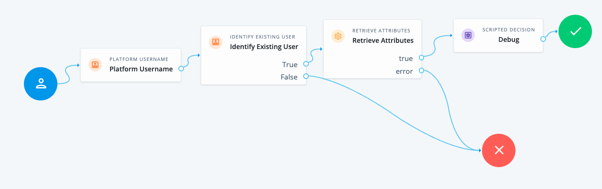
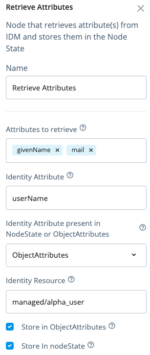

# Retrieve Attributes

## Introduction

Custom node-designer node that retrieves attribute(s) from IDM

## Contents

Example AM tree

## Configuration

Use fr-config-push to push the node into your own AIC tenant

Create a journey using the tree above as a reference. The Node allows you to read the user identifier from either
- nodeState, or
- objectAttributes object in nodeState

Also, it allows you to store the attribute values into
- directly in nodeState
- objectAttributes object in nodeState
or both

