# Identify Existing User by Attribute

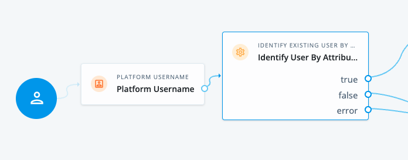

 The Node allows you identify the user based on an identifier found in
- nodeState, or
- objectAttributes object in nodeState

Also, it allows you to store the unique ID into the nodeState

# Retrieve Attributes

Node that retrieves attribute(s) from IDM

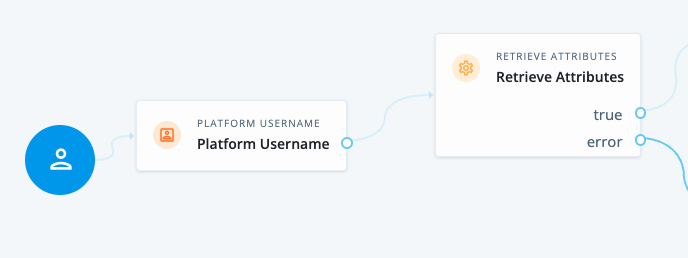

The Node allows you to retrieves attribute(s) from IDM based on an identifier found in
- nodeState, or
- objectAttributes object in nodeState

Also, it allows you to store the attribute values into
- directly in nodeState
- objectAttributes object in nodeState
or both

The 'Is Identity Attribute the _id_' flag determines if the node should skip the search step. If enabled, the node treats the provided identifier as the user's unique system ID (_id / UUID) and retrieves attributes directly.

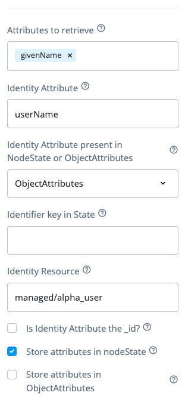

# Patch Attributes

This Node updates (patches) specified attributes on a user's profile based on the user identifier from either
- nodeState, or
- objectAttributes object in nodeState

The new values to be patches are also fetched by the nodeState or objectAttributes, according to the node config.

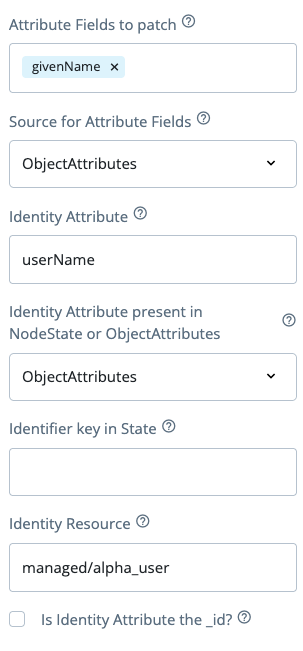

# Node State Value Decision

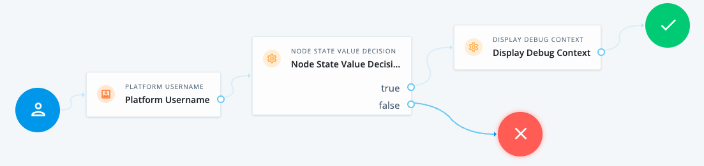

The Node allows compare a nodeState property based on the operation
- Present (checks if the value exists)
- Equals (checks if the value matches a specific expected value)

Also, it allows you to read the state key from 
- directly in nodeState
- objectAttributes object in nodeState

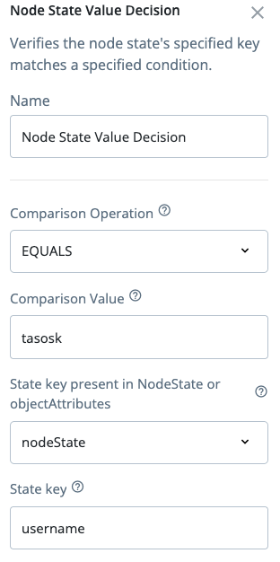

# ESV Boolean Check

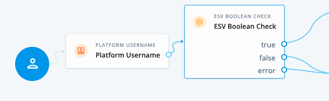

The Node allows to check an ESV value whether it's true or false

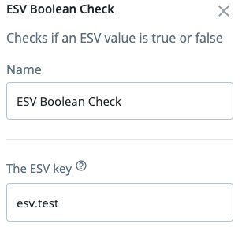

# Display Debug Context

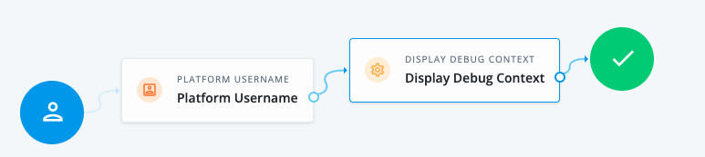

The Node displays debug information into a page. It allows you to fetch 
- nodeState
- objectAttributes object in nodeState
- request parameters
- request headers
- cookies

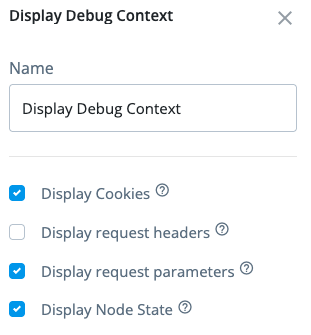

# Merge objectAttributes

The Node merges objectAttributes object into a single storage - useful when objectAttributes is present in both nodeState and transientState. Allows for removing null properties

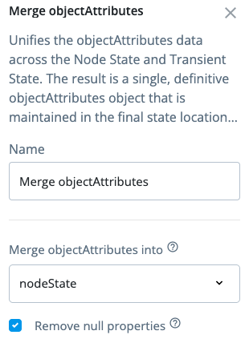

## How to use

Use fr-config-push to push the node into your own AIC tenant or use node importer

